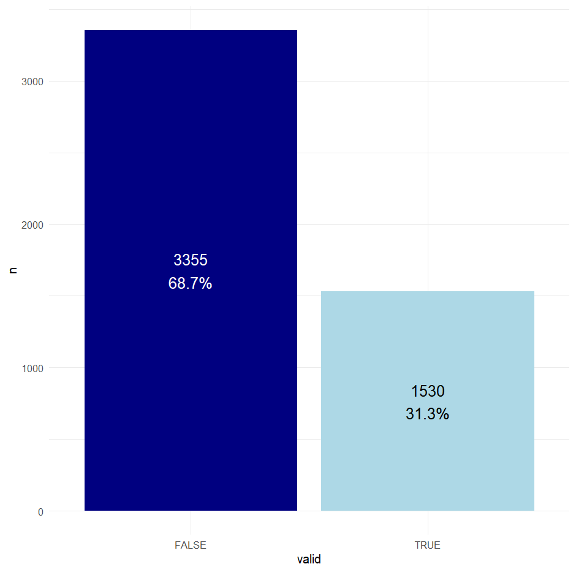

# Introduction

The term has begun now, so I have less time to spend on this work. There are some things from last week that have spilled over into this week. I can refer to the week 11 notebook and pull that list of stuff over later.

# Methods

## Local storage of files

I was looking around for the best way to store the large amount of protein data I now have locally. I have found that something which may work is to use my home NAS (Network Attached Storage) and connect to it via the rclone programme. I can see other people on hawk used it to connect to cloud storage. I started by checking my machine could interface with the NAS by using the command "`ping [my-NAS].myqnapcloud.com`". Which returned successfully. Now I have to try the same thing on hawk, that was successful.

I then ran "`module load rclone/1.64.0`" and "`rclone config`", the personal steps inside that configured the NAS with rclone, this has not lead anywhere at the moment. I will have to consult with Claude.ai about how to get it working (if this is the right avenue to go down at all).

## Host metadata analysis

I would like to begin this process today, its something quick and easy I can do inside of all the more difficult stuff. I created the script "host_metadata_informatics" to do this. This file reads in both metadata files, however, the important one is "accession_information_43668_1696_33882_53335_13687_2025-09-10.rds". I am going to need to extract host information for each accession from inside the list structure "assembly info" \> "biosample" (where it is present). To do that I am going to need to probably employ both for loops and lapply statements.

I need to remember that this data is often split between "host" and "isolation_source", so I am going to need to get both fields. The process of parsing information from deep in a list was much harder than I thought it was going to be. I decided to make a game of it, and now have 4 equally bad ways of doing it, because apparently it is just something that is a pain to do. I then moved onto data manipulation so that the data frames could be used for proper visuals. To do this, I am cutting out all "missing", "not given", etc fields from a unique list. To do this I am using excel on a .csv I wrote out called "unique_host_data.csv" in 02_analysis/metadata. After a bit of playing around with and remembering how to use ggplot2, I created a sample bar chart that just shows the proportions of accessions that do and don't have host info.

I then went on to create a matrix showing the top 5 hosts for each of the 5 bacterial genera of interest. This required further manipulation to make the object a count. Then I used the flextable package to make a table with specific styling which makes it look like a matrix.

## GTDB-Tk

I am having some trouble thinking about how I would go about mentioning that the 10 samples are what they are without saying "I ran them through gtdbtk a year ago". So I may as well just do that process again, after reading a paper or two about it so I know how to do it right this time.

# Results

*Key findings, observations, and data from this week's work.*

# Conclusion

*Summary of outcomes, implications, and next steps.*

# Scientific Papers

*Relevant literature read this week.*

-   The preprint - "The Genetic Basis of Bacterial Adaptation to Hosts" ([Segev et al. 2025](https://doi.org/10.1101/2025.07.19.665706))

-   "Comparison of functional classification systems" ([Zeller and Huson. 2022](https://doi.org/10.1093/nargab/lqac090))

-   "a user's guide to the bioinformatic analysis of shotgun meagenomic sequence data for bacterial pathogen detection" ([Lindner et al. 2023](https://www.sciencedirect.com/science/article/pii/S0168160523004051))
