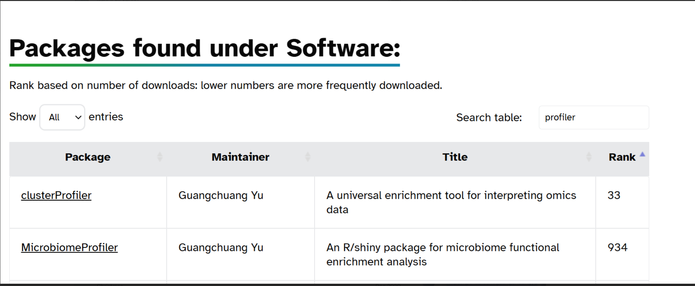

# Introduction

*Brief overview of the week's objectives and context.*

# Methods

*Description of stuff I did.*

Right, basically all I did so far this week was try to figure out a hypothesis. I am not going to be doing the dissertation on the previously mentioned 5 genera, but they have been useful in testing the pipeline. By now, I have arrived at a hypothesis somewhat resembling: "I hypothesise that as a pathogenic species, M. bovis will have a higher enrichment for KEGG pathways involved in amino acid catabolism than a non-pathogenic, environmental Mycobacterium species, such as M. smegmata. This hypothesis is supported by past research, such as [Seth and Connel. 2000](https://pmc.ncbi.nlm.nih.gov/articles/PMC94365/#abstract1), [Agapova et al. 2019](https://elifesciences.org/articles/41129) and [Gibson et al. 2022](https://journals.asm.org/doi/full/10.1128/mbio.00672-22)"

He hasn't said this is final yet, but he aint gonna respond until next week, so I am just going to push forward.

So, I need to figure out what should be done next. There are a few avenues I could go down, maybe ill create codenames for them for fun:

**Path 1: how to back up large files that wont go into github, AKA "Filing Cabinet"**

**Path 2: how to best do KEGG enrichment, AKA "money money money"**

**path 3: download fastas for Mycobacterium (could be urgent because of the whole "government shutdown thing") AKA "Indiana Jones"**

**path 4: improve the host analysis (might not be very relevant any more given the new hypothesis), AKA "worms"**

I think I am going to start with path 2, because its the final step of the pipeline, so it will be done beginning to end before I start funneling in NCBI fastas (or I suppose not NCBI fastas should the NCBI be dissolved in order to funnel money to oligarchs). I found [this link](https://www.kegg.jp/kegg-bin/show_organism?category=Mycobacterium), which shows the Mycobacterium strains in the KEGG database, with their shorthand code. [This page](https://yulab-smu.top/biomedical-knowledge-mining-book/index.html) goes over how to use KEGG to get pathways from annotated protein fasta files (specifically chapter 7: "KEGG enrichment analysis" is relevant to this).

This site recommends the use of the "clusterProfiler" package, with the "enrichKEGG" function. In the past, I was using the "MicrobiomeProfiler" package and the "enrichKO" function. I am not wholly certain what the difference is, but I believe that the former is the newer version to do what the latter could do, but better. So, once I get it working, I am going to have to compare the two systems.

So, I downloaded "clusterProfiler" with the code (gotten off of the Bioconductor website):

`if (!require("BiocManager", quietly = TRUE))    install.packages("BiocManager")BiocManager::install("clusterProfiler")`

Also off of the Bioconductor website is this, which proves the two packages are maintained by the same person, and that clusterProfiler is much more prolific in the modern day than MicrobiomeProfiler.

I found out that I needed to update R in order for it to download correctly, so I did that. This lead me on quite a tangent in order to figure out just how to properly update R, I found out about "Rgui", apparently I can do R through a graphical user interface, weird. I found this on the [NHS R community](https://tools.nhsrcommunity.com/technical-r.html). It tells me that running something like installr::updateR() in the Rgui console will update R, let's see. First, I ran `install.packages("installr")`, which installed that package using the gui. I could then run `installr::updateR()`, there was a new version I needed to download, so I did, it showed me the [NEWS](https://cran.rstudio.com/bin/windows/base/NEWS.R-4.5.1.html). After that, I reloaded Rstudio and it still said R 4.4.2 in the console. After a bit of googling, I found that if I go to the "Tools" menu at the top, into "global options", I could change the R verion there. I ran that and it worked, however, I do not think all my packages moved over, so I ran an install manually, where it said "packages \_\_, \_\_ and \_\_ are needed but not installed: Install". I think this has loaded all of the missing packages, but I am not sure, something to work out before I need to do another R update. I tried to install clusterProfiler, but it has a dependency called "GO.db", which did not install right, so I might have to do something funky in order to get this to work.

I ran `BiocManager::install("GO.db")`, this successfully installed the package. Which allowed me to run the test code:

`data(geneList, package="DOSE")`

`gene <- names(geneList)[abs(geneList) > 2]`

`kk <- enrichKEGG(gene = gene, organism = 'hsa', pvalueCutoff = 0.05)`

`kj <- kk@result`

I then wanted to test this on an accession of my own, so I first brought in one of the backups of the zip files:

`KO_file <- read_tsv("C:/Users/tobyn/OneDrive/Work/tnunn_research/2025 file storage/annotation_200_accessions.emapper.annotations.copy.gz")`

Then, I created an accession column so that I could filter the zip to just a random accession:

`KO_file$accession <- gsub("_[0-9]+$", "", KO_file$#query)`

`first_sample <- filter(KO_file, accession == "GCA_016429035.1") unique(KO_file$accession)`

`first_KO_list <- data.frame(KOs = first_sample$KEGG_ko) %>% mutate(KOs = gsub("ko:", "", KOs)) %>% separate_longer_delim(KOs, ",") %>% filter(!KOs == "-")`

I then ran that vector into the test code from before, using this code:

`first_result <- enrichKEGG(first_KO_list$KOs, organism = 'ko', pvalueCutoff = 0.05)`

`first_resres <- first_result@result head(first_resres)`

Looking at the resulting dataframe in first_resres, I tired to make sense of the columns. Specifically, I wanted to understand what "GeneRatio" and "BgRatio" were.

From what I could find online, and my own interpretation of the results, its like this:

GeneRatio = The number of genes from the list that appear in a specific pathway (each row of the frame is a pathway) / the total number of genes in the list I pass in

BgRatio = The number of genes in that pathway / all the genes in the "universe"

universe = a field that can be changed in the settings of "enrichKEGG()", dictating the total list of genes to compare against as the background. When not manually set, it sets it to all 14409 genes in the KEGG database

This lead me into understanding what other values meant, such as:

RichFactor = The number of genes for that pathway in the list of genes passed to enrichKEGG / the total number of genes for that pathway in the universe (i.e. the proportion of the genes I have inside of the total for the pathway). For example, it is a measurement of pathway "coverage".

FoldEnrichment = I still do not quite get the purpose of. However, I know that it is the GeneRatio / BgRatio (whereas RichFactor is just the numerators from each, this is the whole fraction divided by the whole fraction). So it could be a metric of showing how much more those genes appear in my list compared to background.

So, now that I have what is essentially the full pipeline set up, I need to figure out what I want to do with the data. There are a few ways I could start that:

-   Read around about different types of pathway analysis (what do I actually want to use the data for)

    -   this is going to relate heavily to the hypothesis

-   Read around about what the statistical fields in the output actually mean, the default stat test is "BH", should I be using a different one?

-   how do I limit the output to those that are statistically significant

    -   i.e. do I filter the thing by the RichFactor, the FoldEnrichment or by which rows have a P.adjust below 0.05 or the mysterious q and z values

Basically, now I have all I need (more or less) to "collect" my data, but what experiment am I actually going to be running on it? To recall, my hypothesis (for the moment) is:

"I hypothesise that as a pathogenic species, M. bovis will have a higher enrichment for KEGG pathways involved in amino acid catabolism than a non-pathogenic, environmental Mycobacterium species, such as M. smegmatis. This hypothesis is supported by past research, such as [Seth and Connel. 2000](https://pmc.ncbi.nlm.nih.gov/articles/PMC94365/#abstract1), [Agapova et al. 2019](https://elifesciences.org/articles/41129) and [Gibson et al. 2022](https://journals.asm.org/doi/full/10.1128/mbio.00672-22)"

I have talked to Claude, and maybe it would be a good idea to send an entire genus' worth of KO values through at once, it would certainly be interesting to see what comes back, a test worth doing when the time comes. That may be where I go next, creating a part of the pipeline where I take the .zip files and recombine them, then split by genus.

There are

# Results

**Path 1: how to back up large files that wont go into github, AKA "Filing Cabinet"**

-   before I separate the zip files up and reconstitute by genus, I need to work out a way to synchronise the large files which are too big for github

    -   so that I do not have to provide hard-coded paths to the file locations in my code

        -   like I did in the code above (when I read in the 200....zip to do the example)

        -   `KO_file <- read_tsv("C:/Users/tobyn/OneDrive/Work/tnunn_research/2025 file storage/annotation_200_accessions.emapper.annotations.copy.gz")`

        -   i.e. the files need to be in the project file structure

**Path 2: how to best do KEGG enrichment, AKA "money money money"**

-   Read around about different types of pathway analysis (what do I actually want to use the data for)

    -   this is going to relate heavily to the hypothesis

-   Read around about what the statistical fields in the output actually mean, the default stat test is "BH", should I be using a different one?

-   how do I limit the output to those that are statistically significant

    -   i.e. do I filter the thing by the RichFactor, the FoldEnrichment or by which rows have a P.adjust below 0.05 or the mysterious q and z values

**path 3: download fastas for Mycobacterium (could be urgent because of the whole "government shutdown thing") AKA "Indiana Jones"**

-   Ideally I would do this last, so that the pipeline is all set up and lovely, so it just smoothly slides through

**path 4: improve the host analysis (might not be very relevant any more given the new hypothesis), AKA "worms"**

**path 5: improve the pipeline, I rushed through bits of it, and I know the code could be cleaner, AKA "oil refinery"**

-   (like adding resumability to stuff later on)

-   hard-coded file names

-   hard-coded to specific genera

**path 6: write up the full pipeline end-to-end, maybe in a powerpoint prezzie, or a little infographic or something, AKA "Gaudi"**

-   A. I can make a visual of it

-   B. for my own clarity so I know what is going on where, especially now I am adding all these final steps

-   The files in 00_scipts do not have a number order, so Knowing what order those files are to be run in is going to be important

# Conclusion

*Summary of outcomes, implications, and next steps.*

# Scientific Papers

*Relevant literature read this week.*

-   A comparison of PCR and ELISA methods to detect different stages of Plasmodium vivax in Anopheles arabiensis ([Hendershot et al. 2021](https://doi.org/10.1186/s13071-021-04976-z))

-   

-   
