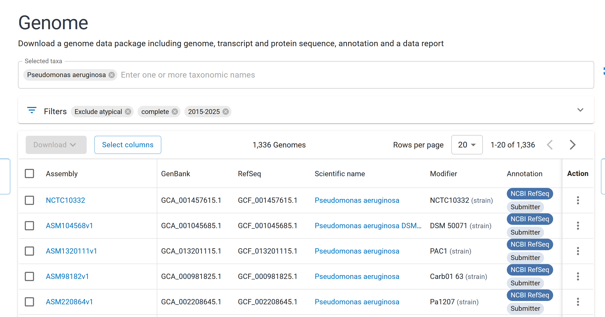

# Introduction

*Brief overview of the week's objectives and context.*

The objective for this week is to sure up the pipeline and rerun it for the M. bovis and M. smegmata samples.

# Methods

*Description of stuff I did.*

First, I want to fix the code that makes the contig IDs in the outputs of the annotation stage, as for the large groups, there was a lot of extra stuff that needs pruning.

Then, I want to make the pipeline less dependent on hard-coded variables. I think I can create some reuseable variables in a script, and then call that in each script, using `source()`, like I do for my functions.

I decided to give up on fixing the contig IDs because it was more trouble than it was worth, as the workaround I created works fine, and I do not want to mess up that stage of the pipeline. I am still going to do the source script thing, as I am going to have to manually update each script anyway.

### Its joever

right, bad news, mycobacterium smegmatis is not mycobacterium, it got moved to mycolicibacterium. I dont think I can use that. Anyway, Myco was just the set dressing over the methods I wanted to use, the internals are still the same if I look for amino acid catabolism in another species. I asked Claude, and he suggested Pseudomonas, he also told me that comparative genomics studies typically use 10-50 representative genomes, which means I can validly use a lower number, makes some of what I done literally fucking pointless, but hey ho. Anyway, this means that the 46k for Pseudomonas aeruginosa can be cut down to size to compare with the 500 or 300 of the others of Claudes suggestions for environmental. Anyway, out of lack of want to download 46k metadata files, I am now using quality checks:

This gets P. aeruginosa down to a reasonable 1,336. So, I would download all those files, look at quality metrics and then keep the top 20-50, why Aaron did not tell me this, I will never know. Anyway, the hypothesis is still sound, the methods are still sound, its just the genus and a bit of extra pipeline-age, so its all good.

Just going to do all 4 species so I have my bases covered, made new "accession_filterer.R" script to go at front of the new pipeline, does a bunch of stuff I already did in past scripts to download with API, now I have to set it so that the top 50 from each species is taken. once putting the Myco species though the same filters I ended up with 30 and 13 a piece, which is less promising than the pseudomonas species just on numbers alone.

So, I can now use:

-   checkM completeness (\>95%)

-   sequence length compared to reference (close as possible)

-   N50 and lower numbers of contigs (high / low as possible)

to filter the accessions that come back.

Right, so in the end, I have a list of 50 each for P. aeroginosus and P. putida. The filter I used was:

`filter(completeness >= 95 & contamination <= 5 & number_of_contigs < 4) |> arrange(number_of_contigs, desc(contig_n50), desc(length_comparison))`

Which limits the list to those withing acceptable checkm scores and low number of contigs, then orders by 1. low contig number, 2. high N50, 3. high length (this prioritises length, even though the ideal would be close to 1, might need to "abs()" it.

### We're Barack

I decided to pull the metadata for the 44k samples for P. aeruginosa, take a bit of a look at what I was dealing with. I then had a meeting with Aaron, by the end of this week I should:

1.  Filter the metadata so I have a list of just animal-associated hosts, for which I can then pull the genomic fastas
2.  plot those on a phylogenetic tree using GTDBTK

# Results

*Key findings, observations, and data from this week's work.*

# Conclusion

*Summary of outcomes, implications, and next steps.*

# Scientific Papers

*Relevant literature read this week.*

-   

-   

-   
