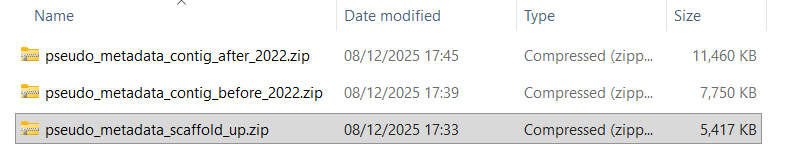

# Introduction

*Brief overview of the week's objectives and context.*

Continuing on from what I did last week.

# Methods

*Description of stuff I did.*

I started by looking around about how I would best go about downloading all the metadata files without hitting the 4000 limit I usually end up hitting. I have seen stuff about "pagination", still not sure what the hell its supposed to mean or how it really works, but it is worth a try. I am having a hard time understanding where I am with the code I have, its been a while since I wrote it and all that knowledge has gone out the window since. So, this new pagination stuff I am going to make in a "pagination_test.R" script, so as to not mess up what I currently have. I had to get Claude.ai to help with this, not proud of that, but coding at this level is just beyond what I am capable of on my own at this time. I was a bit stuck on that API pagination stuff so decided to take a look at the website. It lets me download all 60k in one massive pull, hilarious, to save on space I am taking only "GenBank", and leaving "RefSeq", no particular reason for that one specifically, but taking both would bloat the file and make it take longer. It wouldnt let me do 60k in one, but I managed to split it into 3 batches, roughly 20k a piece, 1st was all ones that were "scaffold, chromosome or complete", 2nd was "contig" for 1980 - 2022, 3rd was "contig" for 23-25. So, for reference in the methods, I downloaded these as of the 8th of Dec 2025, that is something I am going to want to say. So, I have these three files, at a later time I am going to want to parse them for the host and quality metrics to filter and all that stuff. Should have the code for that though, shouldnt be too hard. Well, that was much simpler than mucking about with the API, nice.

# Results

*Key findings, observations, and data from this week's work.*

didnt get around to rewriting the methods, might not get around to it this week either, but its a good reminder:

## Previous methods

Methods:

"Firstly, data is downloaded off of the NCBI genomic database, specifically genomic accessions for the two genera of interest, *M. bovis* and *M. smegmata*. Metadata pertaining to these accessions is also downloaded, as it helps with certain steps of the pipeline, as well as being useful for analysis. This downloading is done through the NCBI REST API, which is called through an Rscript running on the Hawk supercomputer, run by Super Computing Wales, which downloads the vast amounts of information directly to the supercomputer where it will need to be transformed.

From here, the data enters a bioinformatics pipeline. Firstly, the genomic sequences for each accession are translated into protein sequences with Prodigal version \_\_, this stage is not run using the supercomputer's resources, as it is minimally intensive, instead ran on my local area, using my machine's resources. Next, the accessions are annotated for their genes, using EggNOG-mapper version \_\_\_. I split this into two stages as running them separately decreases the over-all time taken. The first stage is 'search', which maps the protein sequences to seed orthologs. These orthologs are then read into the next stage 'annotate', which produces the annotated protein contigs for each accession.

Finally, the genes need to be enriched for KEGG information. the R function 'enrichKEGG' from the 'ClusterProfiler' package does this. Producing KEGG pathway information for each accession, including BgRatio and \_\_\_. This information can then be used to plot the data on a heatmap to compare statistically significant enrichments, after a **statistics step to decide which pathways are significantly more enriched in one group than another (aaron mentioned this, but I need to find it in the original scripts he gave me)**. A chi-squared test can be used to confirm statistical significance."

## new methods so far

### Input - metadata

The pipeline inputs publicly available genomic accessions from the NCBI Genomic database. *Pseudomonas* was the genus of interest for this study as it has many available samples and is a model organim \[etc, but this sentence feels like it could be split between Intro and Methods\]. This is useful because, as will be further discussed later, few of the accessions have adequate or relevant host information for this study, with most either not having host information at all, or a large amount coming from clinical human hosts \[again, feels intro-y, or maybe a "limitations" section\]. This is broken down in Figure X \[worth making a table of host info including humans and NA, I think so\]. On the 8th of December 2025, the database was accessed through the web page: <https://www.ncbi.nlm.nih.gov/datasets/genome/?taxon=286>.

Through selecting all the accessions under the genus *Pseudomonas*, and clicking the "Download" -\> "Download Package" button. It should be noted that, at the time of download, it was not possible to download all accessions in one batch \[58,976 as of the 10th, forgot to write the number down, dont think that level of detail is wholly necessary, so I should be fine\]. Thankfully, the option exists on the web page to filter the data, so files could be downloaded by the time range, each batch downloaded contained roughly 20,000 metadata files for reference. The option to download the genomic fasta file alongside the metadata was de-selected, as those will be downloaded once the filtering step is complete. Specifically, the files of interest in the outputs of this are "assembly_data_report.jsonl", which contain the metadata files for all the accessions in each batch. \[keep the photo of the files?\]

### Analysis - filtering

Due to the files of interest being in the Jsonlite, or .jsonl, format, accessing the information for filtering required specialist tools. In order to do this, duckDB was used, this was done because... \[fill in when done\].

## proto-intro ideas

what am I introducing in the intro of this? remember, broad to thin

paragraph on host association in bacteria - definitely

paragraph on Pseudomonas - definitely

I can draw a link between them. If I start on host-association and then talk about how Pseudo has been studied for that in its paragraph.

paragraph on the advantages and limitations of using pre-existing data - maybe\[?\]

If I choose that one then I can shift that stuff about a lack of host data into it

??? - why host association is useful to study \[hmm... not sure thats it, would be part of par 1\]

??? - introduce the mechanism maybe, I am using Pseudo as the tool, but what does it do that I am looking for in what hosts \[feels like it overlaps with the next bit, maybe though\]

aims and objectives of the study more specifically, hypotheses and that lot - def

\[feels like there is a paragraph missing, goes from very broad to very specific, maybe reading around will help

# Conclusion

*Summary of outcomes, implications, and next steps.*

# Scientific Papers

*Relevant literature read this week.*

-   

-   

-   
