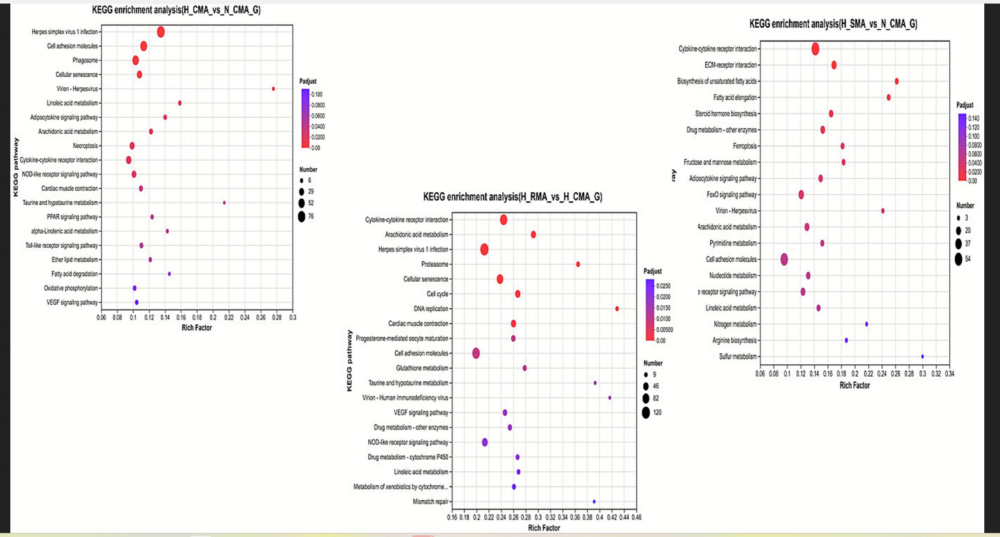
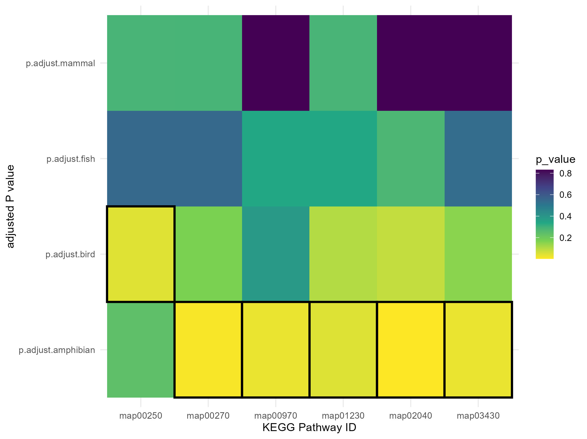
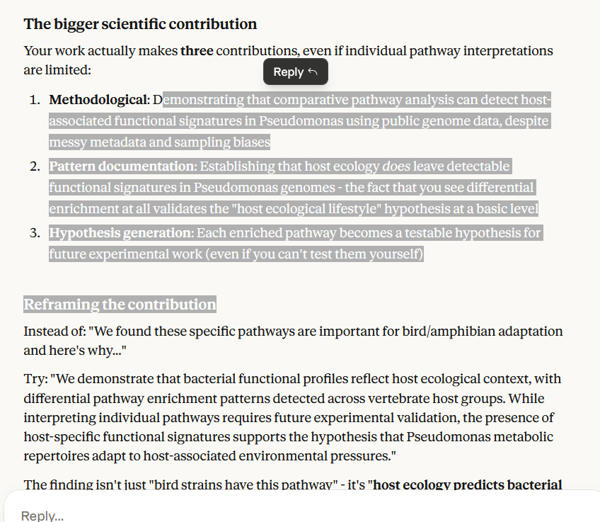

# Introduction

*Brief overview of the week's objectives and context.*

Re-started work in Earnest on the dissertation. Specifically focussing on completing descriptive analysis (running GTDB-Tk and creating the phylogenetic tree of the samples) as well as completing main analysis, involving the running of enrichKO and the interpretation of results.

# Methods

*Description of stuff I did.*

Firstly, GTDB-Tk analysis was considered. Specifically, the outgroup was changed to the sister taxon of Pseudomonas g\_\_Azotobacter. This roots the tree closer and thus makes a proportional view of things more possible. This necessitated the use of genomic fastas, which had long been deleted for space, so I had to run the script that extracted the genomic fastas again, this did 991 of 992. However, as the missing sample was found to have a host of "canis lupus familiaris" (which is excluded as a non-wild host anyway), I continued anyway. I should have mentioned before this that I decided to do all 992 with an animal host and prune after, so that, in case I over-pruned before running it, I would have to run gtdb-tk again. This way, I can just make small tweaks to prune the tree differently. Running this R script to re-make the genomic fastas, on Hawk, necessitated the loading of the containerised R environment singularity.

"module load singularity" and "singularity exec \~/tidyverse_latest.sif Rscript 00_scripts/R_scripts/genomic_fasta_extractor.R"

NOTE: I think I had to download the singularity window onto my section of Hawk, probably detailed in past notebook, not sure how to do that anymore.

As the Necessary genomic files were in the correct input directory, GTDB-Tk ran over night, I had innitially given the job 10 hours, however, it timed out, so, I re-ran it with 24 hours, however, it was able to quickly power through what was already done, so probably did not need the entirety of that time. Thus far, I have looked at the tree in dendroscope (the tree viewing app I use), but have not begun editing or pruning or formatting.

As the output file of eggNOG-mapper had been put in the right format for enrichKO, in enrichKO_runner.R (as in, a unique list of the KOs found in each host group, as well as a unique list of the KOs found in all groups, the "universe"), enrichKO was ran for each group, producing 4 output files that were stored as RDS, this did not take long and did not require HPC. t should be noted that the unique lists were constructed using SQL queried to the duckDB database through R. Not for any particular reason, but there is good value in learning SQL I think.

After they had run, I needed to interpret the results, so, I first looked at the script Aaron had provided when he did something analagous to what I am doing. I learned that he ran each genome of his through eggNOG-mapper individually, and then took the proportion of genomes that had a certain gene over those that did not for the group. As I had ran enrichKO on the whole groups at once, I could not use this method. So, I asked Claude.ai if analysis was still possible the way I had done it, and he said: "**Yes, you can absolutely reach analogous conclusions about host-associated pathway enrichment using your group-wise enrichKO approach**, but you're right that you'll need a different visualization strategy than your supervisor's proportion-based heatmap.

The key insight you've already grasped is this: Your supervisor ran enrichKO on individual genomes and is visualizing "what proportion of genomes in each host group show enrichment for pathway X" (a prevalence-based approach). You ran enrichKO on the complete gene repertoire of each host group and have statistical enrichment metrics for each pathway.

**Both approaches are valid** - they just answer slightly different questions:

-   

-   Your supervisor: "How widespread is this pathway across individuals in each host group?"

-   

-   You: "Is this pathway statistically over-represented in the gene repertoire of each host group?"

-   

For your host-adaptation hypothesis, **your approach is actually more directly relevant** because you're asking whether certain metabolic capabilities are enriched in the pan-genome of host-associated bacterial populations, which speaks directly to functional adaptation at the population level rather than just prevalence.", So, I think I did it right.

I then set about just learning what each of the things in the response from enrichKO meant (with further help from Claude.ai). [**We concluded that the methodology to use was to compare FoldEnrichment (the ratio of the GeneRatio to the BgRatio), RichFactor(the ratio of the absolute amount of the number of KOs in a pathway to background) and p.adjusted (the P value adjucted by "BH", which was like "Benjamini-Hochberg" or something, statistics) for each pathway between the 4 groups, looking for differential expression in these 3 factors.**]{.underline}

I found out that even though enrichKO takes a unique list of KOs, it filters those which do not map to anything or other such vague criterion that cut down the list. Bit of a black-box, but it isnt reasonable to try to understand all of it right now. As the group made up a significant proportion of the universe, I asked Claude if it would be better to use the whole list of bacterial KOs, he said: "**Using the entire bacterial KO universe would actually make your results less interpretable, not more**, for exactly the reason you identified: you'd be diluting your statistics with KOs that have zero relevance to your study system.

Your current approach - using only KOs found in your four host groups as the background - is asking: **"Within the functional repertoire of Pseudomonas strains isolated from wild vertebrate hosts, which pathways are differentially represented across host ecologies?"**

This is precisely the right question for your host-adaptation hypothesis."

Are conversation then turned to the high overlap between the groups, as each made up over 70% of the universe, and over 90% in the case of mammals. We came to the conclusion that Pseudomonas has a large core-genome, but that analysis was still possible. As mammalia is so diverse, and has so many samples in it, maybe it would be possible (as a stretch goal) to do an inter-taxa analysis of mammalia.

[**However, it would be very good to say (in the conclusion), "this work could be expanded on through more specific analysis inside mammalia, which should have enough samples to accomodate that. In the other direction, it may be idea to do analysis between hosted and environmental Pseudomonas, to see how the core-genome splits under wider variations in conditions.**]{.underline}

hmm, I am going to need to explain why those statistics were used, I could probably get away with saying something like: "These are statistics output by enrichKO that define the over-representation of the pathway in a group to the background.", that should be good enough.

### Building on that

#### Enrichment

Now I need to build on both of these paths. The enrichment analysis I think will be simpler and as the main analysis is more important. So, I am going to start with this path, this will involve:

-   reading in the enrichKO output files

-   turning the relevant data into data frames

-   selecting the critical values for the 3 variables of interest, can be as arbitrary as I like, but has to be justifiable

-   somehow combining them or comparing the frames for the 3 variables

-   filtering to only those that are "significantly" different

-   visualizing these differentially expressed pathways, could still do this through a heat map, as I am still comparing through groups

-   try to do some snazzy formatting, maybe including the group the pathway is in, like "metabolism", or something like that

-   output it to pdf or jpeg or something

The script "pathway_analyser.R" was created to do this. It reads in the files, extracts the result information from enrichKO, combines them and then filters to where 1 group is differentially expressed for a pathway compared to the others. This is done through the p.adjusted value, where it is \< 0.05 in one group and \> 0.05 in the others. I have hit a slight roadblock in that all the individual frames are the same size, which feels wrong, and apparently all contain the exact same genes, which also feels wrong. Right, false alarm, the reason they all had the same pathways was because it tested each for each pathway in the universe, the universe comprising 130 pathways. So, there are no pathways in any group that are not represented by at least 1 KO in each group, probably "something something conserved core genome" also probably because each group makes up over 70% of the universe this is likely, ok, so there is no problem.

Right, an interesting dilemma came up when in "pathway_analyser.R" I was trying to full_join multiple dataframes with the same fields. In full_join, the "suffix" command only works on conflicting columns. However, if the left field has suffixes already (as it is itself the result of a previous join) and another column wants to be joined onto it, then the suffix will not be applied, as there are no conflicts (i.e. the object has p_value.amphibian \|p_value.mammal and p_value is being added, no conflict which means the .bird will not be applied). This means this method of suffixing will only work for an even number of groups. So, I discussed this with Claude, if I didnt have an even number of groups, there are a few things to do, but I like the simplicity of his 3rd suggestion. That the suffixes should be added before joining, so that each object gets joined with the suffix already attached. This isnt relevant for this project, as my method works, but just a note in case I try to do something similar later with an odd number of fields.

Right, the pathways with differential enrichment (where 1 group has a p less than 0.05 and the others dont) yielded 6 pathways with none from either mammals or fish. I attribute this to too much variation in the group and too little respectively. Mammals is easier to justify, but I am going to need to dig up that analysis I did a while back where I looked into the Geography and did a little 80/50 analysis of my own based on weird metrics, so that I can evidence (and remind myself) that the fish all come from 1 sampling event on 1 species from 1 river in China, and thus, would not have captured the whole range of pathways expressed more generally in fish, perhaps, perhaps Pseudomonas inhabiting fish and mammals are more generalist, as fish-hosted Pseudomonas still make up 80% of the background universe, so they have plenty of pathways, on the other hand it could be that there are pathways only useful in marine fish or some other type of fish that arent even in the universe, need more data.

I read out the result to "differential_pathways.rds" so that I do not have to run the whole script again after I clear the environment to do tree stuff.

-   will visualise the pathways I do have

-   should consider next steps (higher and lower level analysis) and what might have really caused this pattern in the data, whether amphibian hosts are known for their less general and more derived microbiomes, or whether it is due to the significantly fewer sample count, less variation

-   NOTE: insects excluded due to being too different

-   filtering had to be made obtuse to get 30 amphs

#### Tree

in terms of the tree, the steps are:

-   read it into R

-   begin pruning branches, the outgroup, the reference samples and the samples that are not in any of the 4 groups

-   make it into a circular format and colour the branches, maybe add symbols to the tips

-   output it to a pdf or jpeg or something for presentation

The "GTDB-Tk_tree_maker.R" script should do this, I may want to change bits of it, for example adding pruning steps, developed with Claude.ai. There were 2 more samples that could not be placed, should check to make sure they are not in my list. First prune removes reference genomes, second removes those not with a mammal, bird, fish or amphibian host. The code that creates the object the reference vector comes from in "add_eggnog_annotation_information.sql". The object seemed short, then I remembered that I filtered the object in an obtuse way to try and keep 30 amphibians, thus explaining the discrepancy, thus there are 337 accessions in my list, so there should be 337 tips in the tree. Cool, thats good, those 2 that didnt plot are not in the study, nice. was trying to think of something, maybe about filtering criteria or insects or something. Deprecated old script, didnt want to overwrite it, but also didnt want to use it, may need to do something about that later.

Still getting weird basal spikes that mess up the whole tree, might want to cut them. Colours for the tree taken from the colour scheme of Bang Wong: <https://www.nature.com/articles/nmeth.1618>

due to the 1 weird funky fish line that goes way out, I am doing a version with that cut to see if I can get a good visual with proportional branch lengths. The book from Guanchang Yu very useful. He has a plot that uses dots which means I can have my cake and eat it to, going to try it. Produced a sort of "final" set of trees, one rectangular and one circular, ready for Aarons review. I like the circular one, there is just something about it. Might want to do the same tree but coloured by continent of origin.

it would be cool to do one of these?

# Results

*Key findings, observations, and data from this week's work.*

I see the use of phylogenetics now, mammals and fish are too broad reaching, with wide clusters of just them. This could mean there is not enough inter-host variation, the samples are too genetically similar for differential expression? or they are too wide reaching and thus they make up too much of the background, so they cannot have significant differential expression. Trying to disentangle this pattern in my head is tricky. But, its probably something about phylogenetic similarity and there being too many of them compared to the background. Because I am not measuring diversity in the groups, think I need to know how enrichKO really works. It is probably because the mammals and birds are too similar to the background, because they kind of are the background. Remember I had to remove that fish sample to make it work.

looking good, but I probably want to fill some dead space by like putting the p value in the boxes, maybe some extra info. I could make it interactive, but that doesnt help if its going in a word doc.

# Conclusion

*Summary of outcomes, implications, and next steps.*

Would it be better to take the same number of samples from each group? A random selection of that number. Because I am starting to think that the things seen here are more because "many mammals = more background contribution = under-represented / few amphibians = little background contribution = over-representation". I am not sure, Ideally, I would have more of all groups, but here we are. Would taking a random 30 from the other 3 groups be fairer? as it would mean each group had equal, or there abouts, contribution to the background. However, what is likely to end up happening is that 30 mammal and bird samples from 1 phylogenetic cluster are taken, which could make this problem worse, as little variation in the taxa is captured, which could end up producing false-positives for those groups as well. I think as long as I can justify why I went with this method over the 30/30/30/30, then I will be fine. But what is the justification?

**So, how can I identify what is definitely a false-positive drawn about by a lack of sample count (thus a lack of genetic variation) in the amphibian group and the bird group, and what is a true difference in pathway enrichment?**

Pseudomonas does have a highly conserved core genome (ref), so maybe there are only a few pathways, or none at all, and all I have found are artefacts of low variation in those 2 groups, would enrichKO try to account for this somehow? and would lowering the counts of the other groups help or hurt, as it would undilute the background, and potentially lead to lack-of-variation false positives in other groups.

maybe something like "previous work (refs) have focussed on a specific host taxon, but this study represents a wide-reaching analysis at the level of vertebrate Classes, leveraging public data from a myriad of sources, to look for broad reaching variation in Pseudomonas bacteria.

NOTE: should look to see if species correlate to host taxa

# Scientific Papers

*Relevant literature read this week.*

-   

-   

-   
