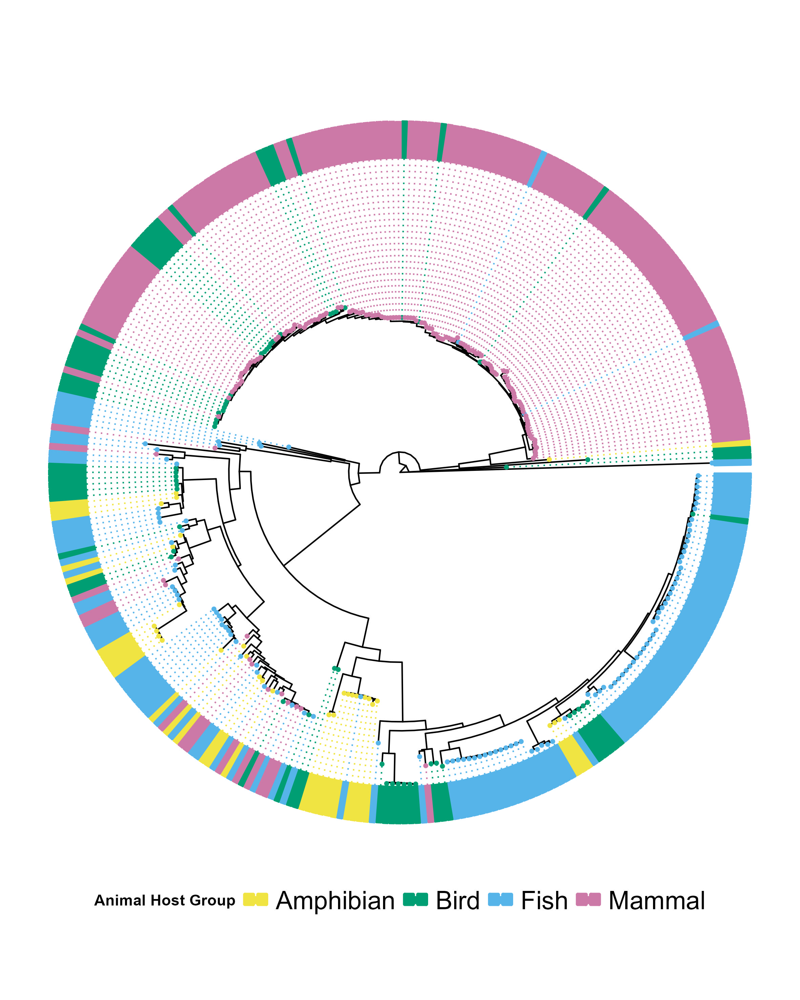
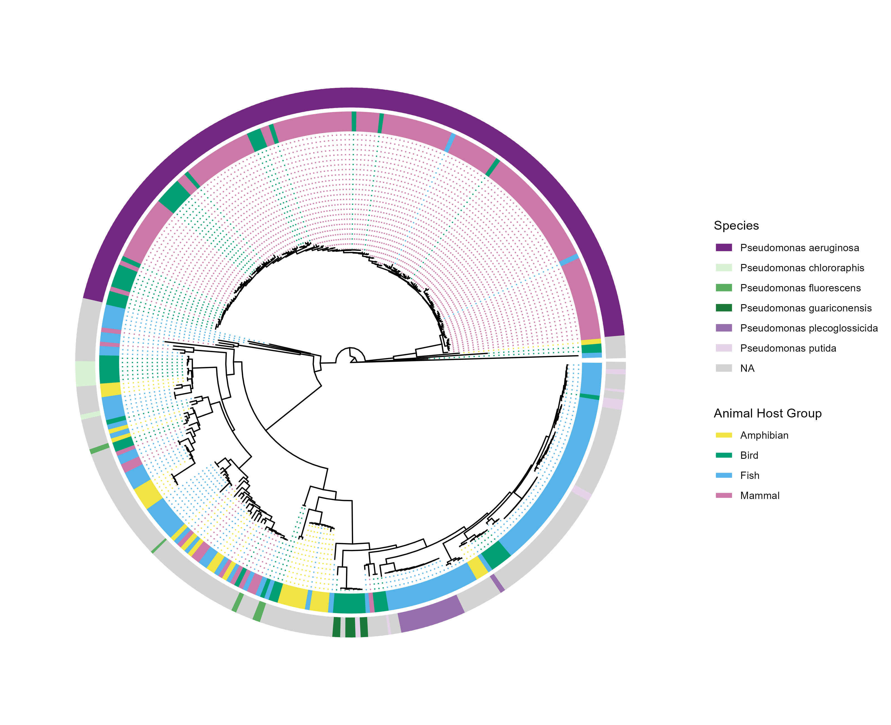

# Introduction

*Brief overview of the week's objectives and context.*

# Methods

*Description of stuff I did.*

Some of the stuff I did on Monday was put in last weeks notebook. Had a meeting with Aaron and now have a laundry list of stuff to do.

## Things Aaron asked me to do

### Interpret tree and heatmap

So, the tree clearly shows that the vast majority of mammal samples are in the very closely related phylogenetic clade on the top of the circle, potentially showing that the majority of mammal samples come from a single species, implying a sampling bias in the data. Cant do anything with that, but I can add it to the ever growing list of disadvantages to this method, as it is another issue of data quality. Similarly, you can see a good amount of fish samples that form large phylogenetic clusters, again implying bias. Whereas, the smaller groups of amphibian and bird hosts have samples appearing across the tree, these 2 groups are the ones for which pathways have been found, implying this phylogenetic bias could be stopping pathways being found in mammals and fish. Other than that main closely-knit clade at the top, the tree shows other large and close clades, such as the one containing the majority of the fish samples, implying they could be from a single species or complex of closely related species.

As mentioned previously. There are no pathways that have been found significantly enriched in fish or mammals. EnrichKO should account for the bias in sample size, so it is not the large sizes that is causing this, but the phylogenetic bias in the data might. 4 of the 6 pathways (00270, 00970, 01230 and 00250) relate to the biosynthesis or metabolism of specific amino acids, implying that Pseudomonas will change its "diet" based on the type of host it is inhabiting, and namely, the types of amino acids that are more abundent in these host Classes. The remaining pathways (02040 and 03430) are pathways involving "Flagellar assembly" and "Mismatch repair" respectively.

Flagellar assembly is the pathway by which bacteria assemble structures with which to move in their environment (<https://www.genome.jp/dbget-bin/www_bget?path:map02040>). This could imply a selective pressure for amphibian-associated bacteria to stay motile on their hosts. It should be noted that extraction site would be important for this. As there are few amphibian samples, it is possible they all come from 1 method of extraction. For example, skin swabs, and that only amphibian-associated skin microbiomes have this adaptation, whereas there are both internal and exturnal microbiomes present in other groups.

Mismatch repair is a mechanism by which defects made in DNA replecation can be repaired, leading to lower rates of mutation and a lower likelyhood of fixing deleterious alleles, reducing fitness. It is said to be highly conserved in bacteria (<https://www.kegg.jp/entry/map03430>). So, the fact it is significantly more enriched in Amphibian hosts than to the background, more so than other host groups is surprising. It could be an artifact of the close relation between the bacteria of the larger groups, meaning that the whole variation for the bigger groups is not being captured, or the artifact of some other bias in the data.

However, should this pathway be truly more enriched than the other groups, it could mean that amphibian-associated Pseudomonas finds itself in a more volatile environment, where DNA damage is more common and thus there is a selection pressure for mechanisms of DNA repair. For example, amphibian microbiomes may have lots of competition. It is also possible there is a sampling bias in the data toward chytrid infected amphibians. As an important emerging disease, the microbiome of amphibians has long been studied in the way the disease infects the amphibian hosts, and these samples may have come from those studies, implying a connection to pathogen-induced damage to the microbiome, so as to parasitise the host.

## Cross examine tree with Pseudomonas complex / species / strain

ok, question 1: how can I get taxonomic info from the Pseudomonas themselves?

It is likely in an object on duckDB, so I can use SQL to pull that data into an R object, which I can combine with an object containing the host information to get a frame of how phylogeny matches host-ogeny.

2: When I do that, I might as well tabulate it, Aaron would want that, so gt or flextable

Then I need to annotate the phylogenetic tree for that info. 3: how would I do that?

I could try highlight clades, he said colouring in the branches would work, possible, I would want to use colours not in the host-palette, but still in a colour-blind friendly pallette.

**OK, I have (in duckDB), made the objects containing data for taxon info, "isolation_source" to see where on the host it came from, and country of origin, maybe a nice chloropleth or an interactive map.**

GCA_052920985.1 - the sample I had to cut because it was weirdly distant from everything, it **is** a Pseudomonas.

I have made some progress toward adding an outer ring to show the species information. The plot still has a ways to go, but I am happy with the progress, notes on what to do in the script. Made a table which I now read into "study_pseudomonas" which will be good for gt-ing and making into a data table for descriptive analysis.

made this tree to cross reference with big species of Pseudo. Unsurprisingly, only species with over 20 samples was aeruginosa. Also, aeruginosa matches quite strongly to the mammal clade, implying bias in the data, possibly of clinical aeruginosa on horses and stuff. Going to try to do the same stuff on country / continent. remember about tables. There are too many Countries, might make it go to continent, expepting China, as that has far and away the most samples, like aeruginosa. China might be worth looking into deeper. Taxonomic analysis might want to go deeper (i.e. taking out the strain from some of them and seeing how the species react).

Talking to Claude about what bias due to aeruginosa and China could mean: "The species bias problem

Now, this is where things get interesting and potentially problematic:

**P. aeruginosa in mammals:** This is a HUGE red flag for interpretation. P. aeruginosa is:

-   

-   An opportunistic pathogen with extremely broad host range

-   

-   Massively over-represented in databases because it's clinically important

-   

-   NOT primarily a mammal-adapted species in nature

-   

If your mammal group is dominated by P. aeruginosa, you're not detecting "mammal host adaptation" - you're detecting **P. aeruginosa's metabolic signature**, which happens to be sampled mostly from mammalian clinical infections.

**Chinese fish samples:** Similarly problematic if you have geographic sampling bias.

#### Could these biases explain lack of enrichment?

Yes, absolutely, but probably not in the way you're thinking:

**For mammals:**

-   

-   If your group is P. aeruginosa-heavy, you might actually see **LESS** enrichment because P. aeruginosa's generalist metabolism doesn't show host-specific adaptation

-   

-   Alternatively, any enrichment you DO see might just be "what P. aeruginosa does" rather than "what mammal-adapted Pseudomonas do"

-   

**For fish:**

-   

-   If samples are geographically clustered, you might be capturing environmental/regional signals rather than host-adaptation signals

-   

-   This could dilute true host-specific patterns OR create false patterns

Also, he said this about my enrichKO analysis (I asked him about it because I think Aaron still believes I am doing it wrong):

"The enrichKO analysis tests whether specific metabolic pathways are statistically over-represented in the collective genomic repertoire of a host group compared to the background distribution across all samples. This approach is appropriate for detecting host-group-level functional enrichment patterns, as it identifies pathways that are more prevalent in the bacterial populations associated with that host ecological niche.

However, this method does not directly test whether individual genomes within a group consistently possess these pathways. A complementary analysis examining the frequency of pathway presence across individual genomes within each host group would address whether enriched pathways represent widespread adaptations or are driven by specific clades."

As China has 100+ accessions, it stayed seperate, but all others were grouped to continents. Got Claude to sort them. Ok, that is good, as expected, China making up 1/3 of the samples is dominating, and it maps almost exactly to the major chunks of fish samples. Now, upgrades: make better the middle ring, statistics? is there a way of statistically analysing how much bias is being caused by the two outer rings? or how mammals correlate to P. aeruginosa.

Big numbas:

China = 103/337 samples, more than double UK at 44, by far biggest contributor

P. aeruginosa = 151 samples, so about half of the 337, next nearest single species is P. plecoglossicida at ... 14, so safe to say the only major group.

Right, after cutting out the strain info from the organismName so that more stuff could be binned into the top 6 species, the number of "Pseudomonas sp.'s has increased dramatically, but as they could be any species of a specific strain, cant use them. Plecoglosicida has increased to a whopping 16. So, not worth making a tree from this unless I can use sp. Conclusion, strain doesnt make enough of a difference to bother updating tree again, as numbers either shift minutely, or not at all in the case of aeruginosa.

## Use the background as the whole enrichKO universe and compare the output with what I already have.

# Results

*Key findings, observations, and data from this week's work.*

# Conclusion

*Summary of outcomes, implications, and next steps.*

# Scientific Papers

*Relevant literature read this week.*

-   

-   

-   
