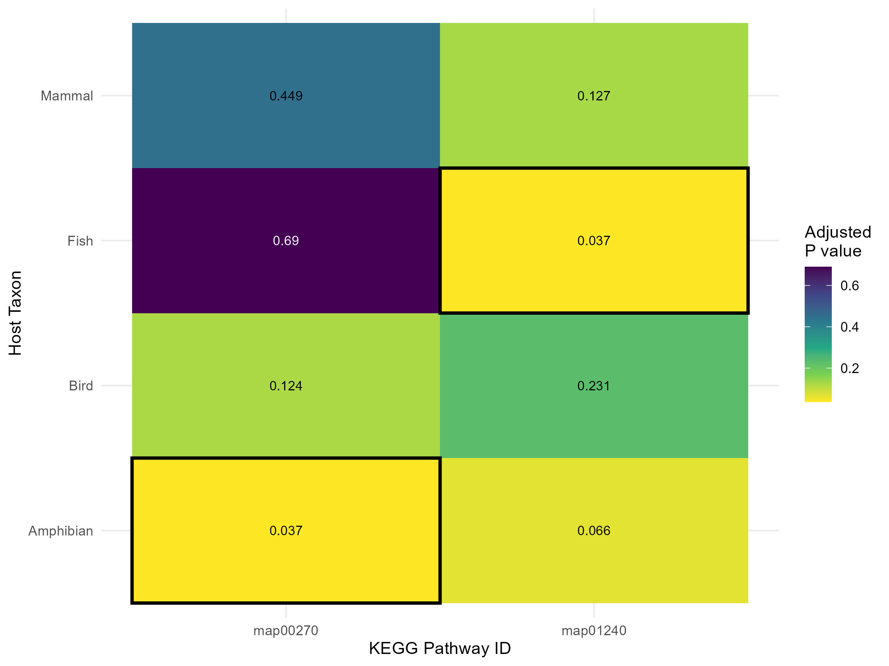

# Introduction

*Brief overview of the week's objectives and context.* did some skipping, mostly write up and analysis anyway, just want to get this project done.

# Methods

*Description of stuff I did.* Found out that I have been kinda shit at tracking what I did and didnt filter based on quality criteria. I created an object which will become a supplemental (or regular) table which did filter the gtdbtk phylogenetic analysis by quality, however, the list of KOs I passed to enrichKO was not filtered, meaning that the list of KOs was probably not representative of my population, this is kind of shit and means I have to run that again. Not a big deal, but it would have been very bad if I missed it. Now I am starting to wonder, what other dumb shit have I missed? I need better database management and organisational skills.

Isolation source is a bit of a mixed bag, going to pass the list to Claude to see if he can make it "internal, exturnal and unknown". This does assume that internal and external bacteria will have similar properties, will need a ref for that, but I cant exactly go into any more detail than that. Will need to make those into supplementary tables for the appendix.

Ok, so, because of the size of the data, the pngs which show data for the whole thing are kinda useless. So, I am going to need an alternate strategy for the appendix, maybe a link to a shiny app (unlikely, no time) or to the duckDB database?

Right, the filtering step is: "WHERE ah.domestication_status IN ('Wild', 'Both') AND pm.checkmInfo.contamination \< 16 AND pm.checkmInfo.completeness \> 79 AND ah.animal_group IN ('Mammal', 'Bird', 'Amphibian', 'Fish');". This includes the Claude identification of Grouping, the Claude Identification of wild or domestic and the checkm scores contamination 15 and under, completeness 80 and up, so as to get all the frogs.

# Results

*Key findings, observations, and data from this week's work.*

So, rerunning the analysis with the correct list of kos results in 2 pathways... is it too late to do the enrichKO analysis the wrong way? anyway, 00270 is a remainer from the last analysis using the overblown list of kos from the unfiltered (by quality) accession list. It means Citosine and Methionine metabolism. Map01240 is new, and in fish instead of birds, almost in amphibians. It is "biosynthesis of cofactors", which means, creating molecules used in enzyme activity, unsure is to why that would only be used in fish hosts. Next heatmap up should be internal vs exturnal stuff. This does not leave me with much in the way to analyse, however, this is the correct way to do it, so I guess I am stuck with this one, either that, or I make a new tree with all 988 samples, and dont do any quality criteria, but that seems like the wrong thing to do.

# Conclusion

*Summary of outcomes, implications, and next steps.*

# Scientific Papers

*Relevant literature read this week.*

-   

-   

-   
