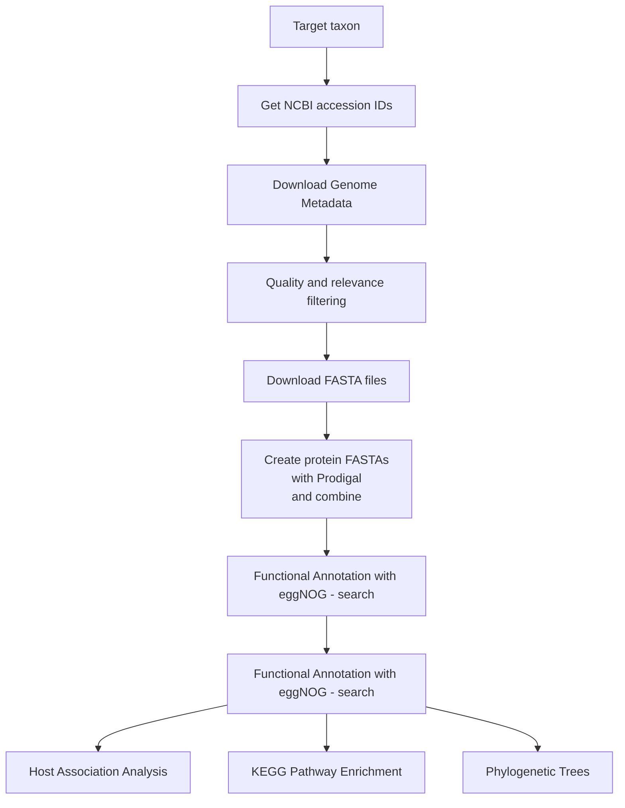

# Bacterial Comparative Genomics Pipeline

A bioinformatics pipeline for analyzing bacterial genomes with a focus on host-microbe associations in *Pseudomonas* species.

## Table of Contents
- [Overview](#overview)
- [Features](#features)
- [Requirements](#requirements)
- [Installation](#installation)
- [Pipeline Workflow](#pipeline-workflow)
- [Usage](#usage)
- [Project Structure](#project-structure)
- [Citation](#citation)
- [License](#license)

## Overview

This repository contains the scripts and workflows used for an undergraduate dissertation investigating host-associated bacterial populations. The pipeline downloads genome data from NCBI, performs quality filtering, predicts genes, annotates protein functions, constructs phylogenetic trees, and analyzes metabolic pathway enrichment patterns across different host environments.


## Features

- **Automated NCBI data retrieval** using REST API
- **Quality-based genome filtering** (completeness, contamination, assembly metrics)
- **High-throughput protein prediction** with Prodigal
- **Functional annotation** using eggNOG-mapper
- **Phylogenetic analysis** with GTDB-Tk
- **Statistical analysis** of host associations and pathway enrichment
- **HPC-optimized** for Slurm workload managers

## Requirements

### R Packages
```r
# Core packages
httr2          # REST API calls
tidyverse      # Data manipulation (dplyr, purrr, ggplot2)
jsonlite       # JSON parsing
here           # Path management

# Bioinformatics packages
BiocManager
clusterProfiler  # Pathway enrichment
GO.db

# Visualization
ggplot2
flextable
scales
enrichplot
```

### Bioinformatics Tools
- **Prodigal** v2.6.3 - Gene prediction
- **eggNOG-mapper** v2.1.12 - Functional annotation
- **GTDB-Tk** v2.1.1 - Phylogenetic classification
- **DIAMOND** - Fast protein alignment (via eggNOG-mapper)

### HPC Environment
- Slurm workload manager
- Singularity containers
- Module system for bioinformatics tools

## Installation

1. **Clone the repository**
```bash
git clone https://github.com/tobiasnunn/undergrad_dissertation.git
cd undergrad_dissertation
```

2. **Install R packages**
```r
install.packages(c("httr2", "tidyverse", "jsonlite", "here", 
                   "ggplot2", "flextable", "scales"))

if (!require("BiocManager", quietly = TRUE))
    install.packages("BiocManager")
BiocManager::install(c("clusterProfiler", "GO.db", "enrichplot"))
```

3. **Set up NCBI API credentials**
Create a secrets file with your NCBI API key (see `Utility_functions.R` for format)

4. **Configure HPC modules** (if using Slurm)
```bash
module load Prodigal/2.6.3
module load eggnog-mapper/2.1.12
module load gtdb-tk/2.1.12
```

## Pipeline Workflow



### Stage 1: Metadata Acquisition
Although there are scripts in the repo which do this, I found the quickest way was to manually download them from the NCBI website and then read them into a duckdb database.

### Stage 2: Genome Download
**Scripts:** `fastafile_getter.R`, `fasta_getter_runner.sh`

- `fasta_getter.R` looks at a file `01_inputs/03_metadata/filtered_accession.tsv` for the list of accessions to download their fastas
- `fasta_getter_runner.sh` is the Slurm script that controls this process

### Stage 3: Create protein fasta
**Scripts:** `prodigal_translationiser.sh`

- Use Prodigal to convert nucleotide sequences to amino acid sequences
- Updates the config label to include the accession ID
- Combine all proteins into single FASTA file - this is much more performant for eggNOG-mapper

### Stage 4:eggNOG search
**Scripts:** `eggnog_searcher.sh`,
- runs the first phase of eggNOG annotation, creates `*.emapper.hits` file and `*.emapper.seed_orthologs` file

### Stage 5:eggNOG annotation

**Scripts:** `eggnog_annotator.sh`
- runs second phase of eggNOG annotation, Add KEGG, GO, and COG functional annotations, creates `*.emapper.annotations` file


## Citation

If you use this pipeline, please cite:

```
[Tobias Nunn] (2025). Bacterial Comparative Genomics Pipeline for Host-Microbe Association Analysis.
GitHub repository: https://github.com/tobiasnunn/undergrad_dissertation
```

## License

This project is licensed under the MIT License - see the LICENSE file for details.

## Acknowledgments

- Supercomputing Wales for HPC resources
- NCBI for genome data and API access
- eggNOG database for functional annotations
- GTDB for phylogenetic classification

TODO: add citations for Prodigal etc

## Contact

For questions or issues, please open an issue on GitHub.

---

**Last updated:** December 2025
